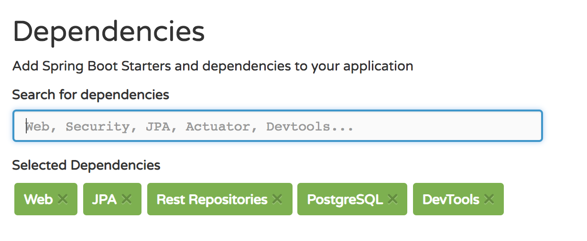

# Lab + Homework

Given the basic code for classes and JpaRepositories for a whisky tracker, your task for this lab + homework is to complete the custom queries and connected them to appropriate RESTful endpoints.


**Whisky**

- `name` - the name of that individual whisky often uses the name of the distillery. An example is "The Glendronach - Revival" which is from "Glendronach" distillery
- `distillery` - the distillery object that it's related to
- `year` - the year edition that the whisky was released/ bottled. The year is not a way of determining the age.
- `age` - how long the whisky in the bottle was matured for before bottling

**Distillery**

- `name` - The name of the whisky distillery.
- `region` - The region of scotland where the whisky is from. These are one of either {**Lowlands**, **Speyside**, **Highlands**, **Islay**, **Campbelltown**, **Island** }
- `whiskys` - the list of related whiskies tracked against that distillery

## MVP

* **Custom Queries + REST** Write each of the following queries and connect them to an appropriate controller:
  * get all the whiskies for a particular year
  * get all the whisky from a particular region 
  * get all the distilleries for a particular region
  * get all the whisky from a particular distillery that's a specific age (if any)
  * Get disilleries that have whiskies that are 12 years old 


## Tips
* Use a ddl-auto setting of `create-drop` when doing development. This means every time the app starts, the schema is created, and when the app stops the schema is destroyed.
* Use packages for each repository type. For example, all Distillery repositories (Custom, Impl and actual) should go in the same package called DistilleryRepository
* Reminder on which dependencies to use with spring Initilizr 
* Remember to add this dependency in your pom.xml

```xml

<dependency>
    <groupId>javax.xml.bind</groupId>
    <artifactId>jaxb-api</artifactId>
    <version>2.3.0</version>
</dependency>

```
